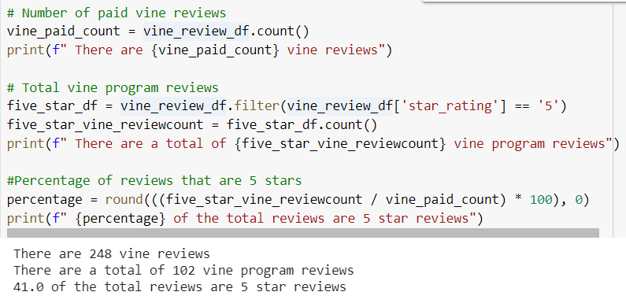
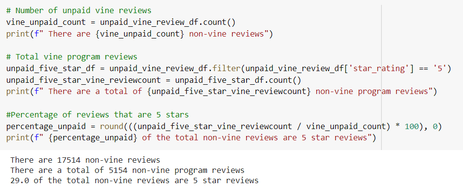

# Amazon-vine-analysis

The goal of this project is to determine if there is any bias by reviews from the members of the Amazon Vine program. The Amazon Review data gathered for video using is using PySpark, and we are mainly focusing on the software product reviews. 

# Result
## Vine Reviews

Based on the calculations, there are a total of 248 reviews under the Amazon vine programs, with 102 reviews with 5 star reviews, and 41% of the total reviews are 5 stars. 

## Non-vine Reviews

Based on the calculations, there are a total of 17514 reviews not under the Amazon vine programs, with 5154 reviews with 5 star reviews, and 29% of the total reviews are 5 stars. 
